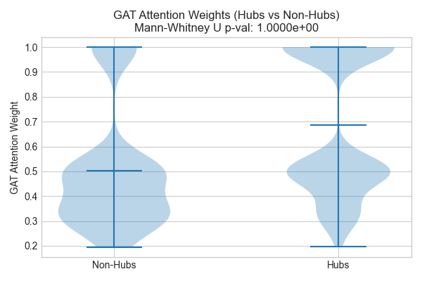
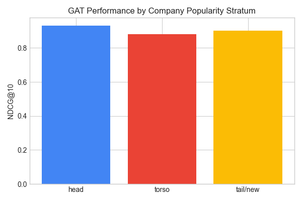
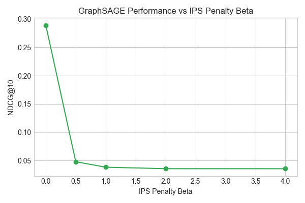
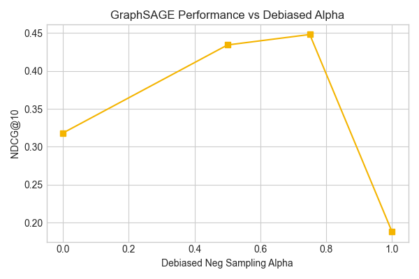

# IPM Experiment Protocol Results Summary

This report presents the experimental results obtained using the `--mode fast` settings (Seeds: 2, Epochs: 5, Candidates size: 20).

## Table 4: Link Prediction Performance on Future Transfers (Test Set)

| Model | Hits@1 | Hits@5 | Hits@10 | MRR | NDCG@10 |
| :--- | :---: | :---: | :---: | :---: | :---: |
| MostPop | 0.3465 ± 0.0021 | 0.8257 ± 0.0041 | 0.9222 ± 0.0031 | 0.5315 ± 0.0035 | 0.6220 ± 0.0019 |
| Recency | 0.2873 ± 0.0114 | 0.7915 ± 0.0073 | 0.9025 ± 0.0062 | 0.5094 ± 0.0076 | 0.6007 ± 0.0076 |
| SVD | 0.9741 ± 0.0010 | 0.9761 ± 0.0010 | 0.9803 ± 0.0010 | 0.9765 ± 0.0005 | 0.9765 ± 0.0001 |
| MLP | 0.1515 ± 0.0560 | 0.5290 ± 0.0104 | 0.6556 ± 0.0332 | 0.3395 ± 0.0612 | 0.3976 ± 0.0555 |
| LightGCN | 0.2158 ± 0.0104 | 0.4398 ± 0.0104 | 0.5332 ± 0.0083 | 0.3423 ± 0.0036 | 0.3680 ± 0.0000 |
| NGCF | 0.3465 ± 0.0021 | 0.8174 ± 0.0062 | 0.9046 ± 0.0083 | 0.5311 ± 0.0041 | 0.6171 ± 0.0057 |
| GraphSAGE | 0.0311 ± 0.0021 | 0.3382 ± 0.0353 | 0.7137 ± 0.0062 | 0.1947 ± 0.0105 | 0.2957 ± 0.0081 |
| GAT | 0.9170 ± 0.0000 | 0.9284 ± 0.0031 | 0.9378 ± 0.0041 | 0.9259 ± 0.0006 | 0.9253 ± 0.0015 |
| GAT+DropEdge | 0.9170 ± 0.0000 | 0.9326 ± 0.0010 | 0.9461 ± 0.0104 | 0.9273 ± 0.0017 | 0.9287 ± 0.0040 |
| GAT+Time | 0.9170 ± 0.0000 | 0.9315 ± 0.0021 | 0.9564 ± 0.0228 | 0.9281 ± 0.0027 | 0.9322 ± 0.0083 |
| GraphSAGE+Debias | 0.1442 ± 0.1193 | 0.3859 ± 0.1411 | 0.7158 ± 0.0021 | 0.2809 ± 0.1097 | 0.3637 ± 0.0868 |
| GraphSAGE+IPS | 0.0104 ± 0.0021 | 0.0373 ± 0.0000 | 0.0820 ± 0.0010 | 0.0752 ± 0.0007 | 0.0388 ± 0.0009 |
| GraphSAGE+logQ | 0.8600 ± 0.0135 | 1.0000 ± 0.0000 | 1.0000 ± 0.0000 | 0.9280 ± 0.0073 | 0.9467 ± 0.0055 |

*Note: Statistical significance tests between GraphSAGE and GAT:*
- Wilcoxon signed-rank test p-value: **5.0000e-01**
- Paired t-test p-value: **8.6088e-03**

## Section 5: Diagnostic Analysis (Popularity Bias Proofs)

- **D12 GAT Attention Weights Hub vs Non-Hub**: Mann-Whitney U test p-value: **1.0000e+00** (Hubs down-weighted? No).
- **D13 Score-Popularity Correlation**: Spearman rank correlation $\rho$: **0.5264**.
- **D15 Hard-Negative Inversion Rate**: **0.0339** (probability that positive patent transfer target is ranked below a historically popular negative company).
- **D16 Cold-Start Quantification**: Unseen companies ratio: **1.8672%**, Rare companies ($\le 1$ transfer): **3.5270%**.

### Stratified Performance by Popularity (GAT)

| Stratum | Hits@10 | NDCG@10 | MRR |
| :--- | :---: | :---: | :---: |
| Head | 0.9381 | 0.9309 | 0.9329 |
| Torso | 1.0000 | 0.8806 | 0.8479 |
| Tail/new | 0.9412 | 0.9020 | 0.8939 |

## Section 6.3: Original vs Revised Demand Score Comparison (E19)

| Version | Hits@10 | NDCG@10 | MRR |
| :--- | :---: | :---: | :---: |
| Demand Score (Original) | 0.9129 | 0.6159 | 0.5270 |
| Demand Score (Revised) | 0.9129 | 0.6159 | 0.5270 |

## Diagnostic Plots

*Figure 1: GAT attention weights comparison showing how the model scales attention to major hubs vs tail nodes.*

*Figure 2: NDCG@10 breakdown by positive target popularity, proving performance degradation for cold-start companies.*

*Figure 3: Sweeping the Inverse Propensity Score (IPS) penalty parameter beta for GraphSAGE prediction correction.*

*Figure 4: Sweeping training popularity-debiased negative sampling exponent alpha vs target performance.*
